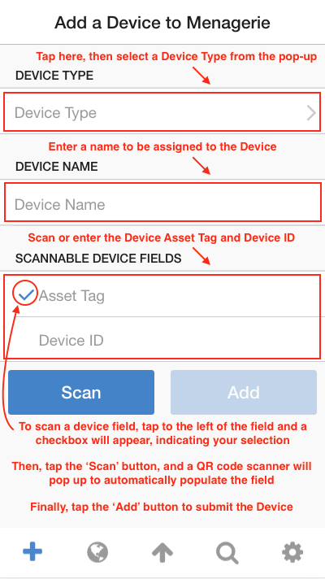
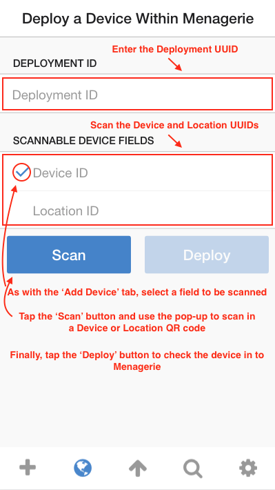

## Menagerie 2.0 Mobile App Documentation

This document will attempt to provide a comprehensive overview of the Menagerie
2.0 Mobile App, a compaion application to the Menagerie 2.0 Device Management
System.

<!-- markdown-toc start - Don't edit this section. Run M-x markdown-toc-generate-toc again -->
**Table of Contents**

- [Prerequisites](#prerequisites)
- [Installation](#installation)
    - [Cordova Requirements](#cordova-requirements)
    - [Xcode Requirements](#xcode-requirements)
    - [Build for iOS](#build-for-ios)
- [Usage](#usage)
    - [Configuring the Application](#configuring-the-application)
    - [Adding a Device](#adding-a-device)
    - [Deploying a Device](#deploying-a-device)
    - [Updating a Device](#updating-a-device)

<!-- markdown-toc end -->

### Prerequisites

Before attempting to install this application, ensure you have the following:

- git
- Xcode 8.x
- Apple Developer Account
- npm

### Installation

#### Cordova Requirements

Clone the application's `git` repository with the following command:

    git clone git@github.com:jkachmar/menagerie-v2-mobile.git

Navigate to the source code repository and install some dependencies:

    cd menagerie-v2-mobile
    npm i -g cordova
    cordova platform add ios
    cordova plugin add cordova-plugin-console
    cordova plugin add phonegap-plugin-barcodescanner
    cordova plugin add cordova-plugin-whitelist
    
#### Xcode Requirements

Launch Xcode and navigate to **Xcode -> Preferences** in the title bar.

Under **Accounts**, add your Apple Developer Account ID if it is not already
present. Upon selecting your Apple ID, you should see a window pane with a 
**Team** field (e.g. *Joe Kachmar (Personal Team)*).

#### Build for iOS

From the `menagerie-v2-mobile` directory, run `cordova build ios` and verify
that the build completes without errors.

From Xcode, select **File -> Open**, navigate to 
**menagerie-mobile-v2/platforms/ios**, and open the directory.

Select **menagerie** in the left column, then select your *Development Team* 
from the **Team** dropdown.

Select your iOS device from the toolbar...

...and wait for Xcode to build symbol files for the device. This may take
a long time.

Select the **Play** button from the toolbar and Xcode will build the app and
copy it to your iOS device. After the build is complete, you will need to go to
**Settings -> General -> Profile -> <Your Developer Id>** and select *Trust*.

The application should now be present on your home screen!

### Usage

Usage of the Menagerie Mobile App is split up into five components, from left
to right on the bottom tab-bar:

- Adding a Device
- Deploying a Device
- Updating a Device
- Searching for a Device or Location
- Configuring the Application

#### Configuring the Application

#### Adding a Device

#### Deploying a Device

#### Updating a Device

