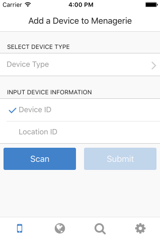

## Menagerie 2.0 Companion Application

<div style="text-align:center"></div>

This is the mobile companion to the upcoming [Menagerie v2] device management
system. The app is meant to provide a proof-of-concept for interacting with
Menagerie's new features, as well as a test of rapid prototyping simple CRUD
apps with [Cordova] and [Onsen UI].

[Menagerie v2]: https://github.com/goliatone/menagerie
[Cordova]: https://cordova.apache.org/
[Onsen UI]: https://onsen.io/

### Development

#### Desktop

```
npm install -g monaca
monaca preview
```

#### iOS Emulator

```
npm install -g cordova
cordova platform add ios
cordova plugin add cordova-plugin-console
cordova plugin add phonegap-plugin-barcodescanner
cordova plugin add cordova-plugin-whitelist
cordova build ios
```

#### iOS Hardware

Launch Xcode, open `platforms/ios` as an existing project, select your iOS 
device from the dropdown, and select the build/deploy button.
